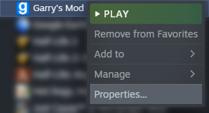
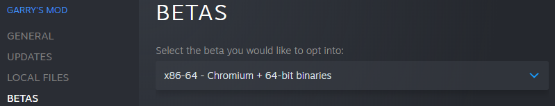
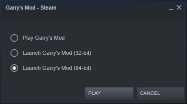

# Help Section
This article is provided to resolve common technical issues with servers or Garry's Mod itself.

If more assistance is needed, feel free to contact us on our [Discord server](https://discord.gg/H3ztBSer).

## MOTD / Media Player Issues
If you're having problems with the MOTD or Media Players (such as not being able to see content), try to follow these steps in order to resolve those issues:

*Right-click on Garry's Mod in Steam and click Properties.*

*Go to the 'Betas' tab of the window and select 'x86_64' then close the window.*

*Once Steam is done updating, open Garry's Mod and select 64-bit each time.*

*All issues regarding web content should now be resolved and you may proceed to rejoin.*